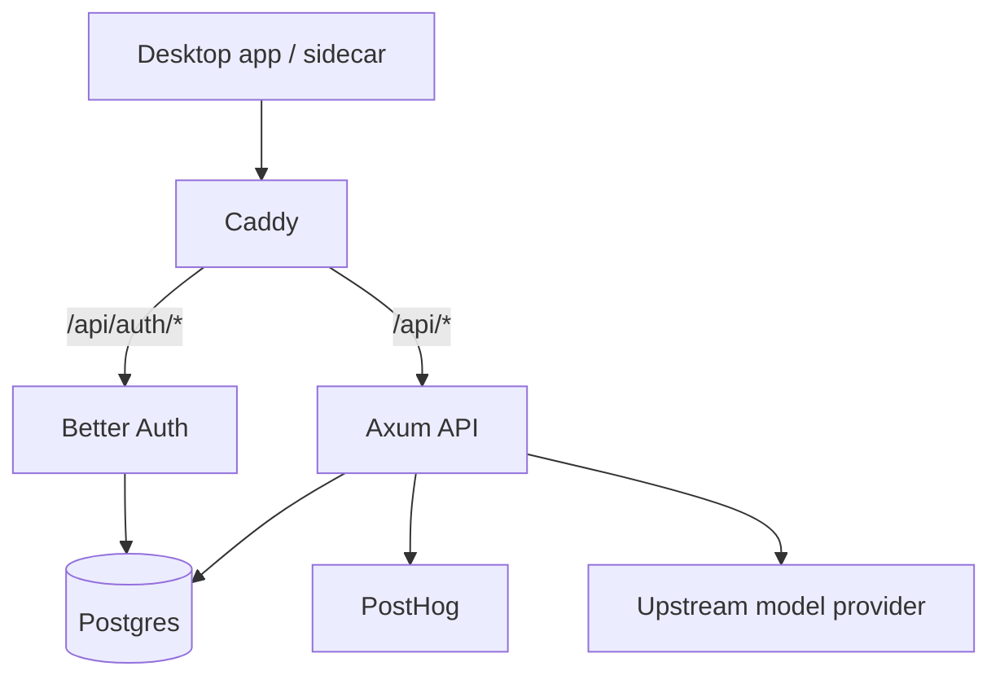

# zWork Cloud Deployment

This document describes the cloud stack that sits behind `api.tryzwork.app`.

## Source of truth

Use `cloud-src/` as the checked-in deployment source.

Relevant files:

- `cloud-src/docker-compose.yml`
- `cloud-src/Caddyfile`
- `cloud-src/api/src/main.rs`
- `cloud-src/auth/index.ts`
- `cloud-src/db/schema.sql`

The older `cloud/` directory is not the deployment source to trust for current behavior.

## Stack

| Service | Path | Responsibility |
|---------|------|----------------|
| Caddy | `cloud-src/Caddyfile` | TLS, host routing, reverse proxy |
| Axum API | `cloud-src/api` | desktop auth exchange, analytics, managed model gateway |
| Better Auth | `cloud-src/auth` | Google OAuth and session management |
| Postgres | compose service | auth and zWork app state |
| pgAdmin | compose service | admin tooling, intentionally not public |

## Public hosts

| Host | Expected purpose | Current posture |
|------|------------------|-----------------|
| `api.tryzwork.app` | auth + API | public |
| `analytics.tryzwork.app` | shortcut to PostHog | public |
| `db.tryzwork.app` | pgAdmin | blocked with `403` by default |

## Routing model



## Environment variables

Minimum server env:

```bash
DATABASE_URL=postgres://...

GOOGLE_CLIENT_ID=...
GOOGLE_CLIENT_SECRET=...
BETTER_AUTH_SECRET=...

POSTHOG_API_KEY=...
POSTHOG_HOST=https://us.i.posthog.com

OLLAMA_API_KEY=...
OLLAMA_BASE_URL=https://api.ollama.com/v1
OLLAMA_MODEL=minimax-m2.7:cloud

ROOT_REQUESTS_PER_DAY=200
MAX_CONCURRENT_ROOT_RUNS=3
DEV_COUPON_CODES=zwork-dev-pro

CORS_ALLOWED_ORIGINS=tauri://localhost,http://tauri.localhost,http://localhost:1420,http://127.0.0.1:1420,https://tryzwork.app,https://www.tryzwork.app,https://api.tryzwork.app
```

Notes:

- `OLLAMA_API_KEY` should be provided through env, not embedded in source.
- If you insist on a non-production fallback for internal testing, use `ZWORK_TEST_OLLAMA_API_KEY` in env rather than checking a token into git.

## Deployment

```bash
cd ~/cloud
sudo docker compose up -d --build
```

## Health checks

```bash
curl https://api.tryzwork.app/health
curl -i https://api.tryzwork.app/api/session
curl -i "https://api.tryzwork.app/api/desktop/auth/start?port=43123"
curl -i https://db.tryzwork.app/
```

Expected:

- `/health` returns `OK`
- unauthenticated `/api/session` returns `401`
- `/api/desktop/auth/start` returns `200`
- `db.tryzwork.app` returns `403`

## Security posture

## Already tightened

- desktop auth is server-backed
- public pgAdmin access is disabled at the proxy layer
- cloud API CORS should be restricted to desktop/dev/site origins
- hosted model gateway uses environment configuration rather than source-embedded credentials

## Still worth hardening

- add infra-level secrets management instead of flat `.env`
- reduce auth/API coupling by documenting migration ownership clearly
- add alerting around auth failures and gateway upstream failures
- add server-side metrics for update adoption and auth conversion

## Operational reminders

- Stripe is optional for now; coupon unlocks can exercise the paid path before billing goes live.
- Rate limits should be enforced on root user requests, not every internal model continuation.
- The updater path is only as trustworthy as the release pipeline; keep the release workflow green and signed.
